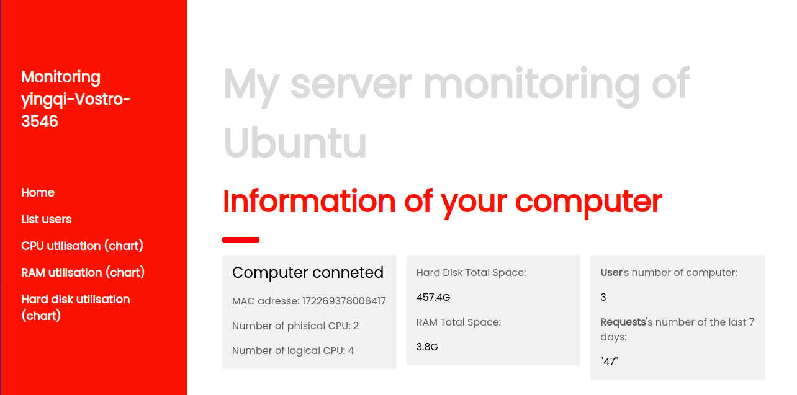
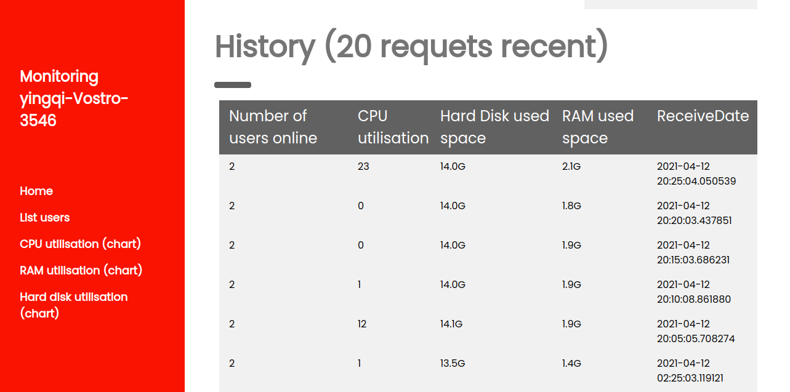
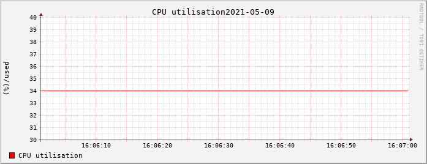
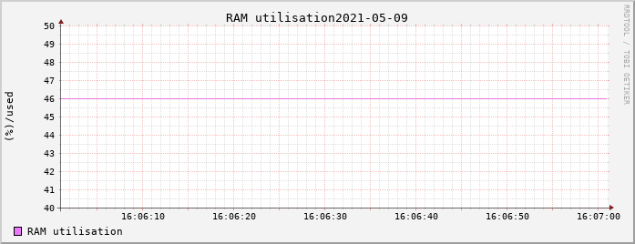
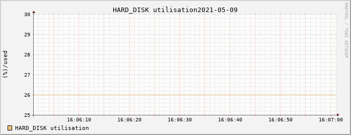

# MonitoringApp

The Monitoring app provide monitoring of system Linux.

This project use a client side collector on each machines to collect data about temperature, ram usage, cpu usage, etc .. and throw them to the Flask REST API via the HTTP protocol.

On the server side, 
- you can display all the data collected since the past 7 days on a web GUI thanks to the Flask server, Jinja2 and some JavaScript libraries.
- you have 3 graphs for display the informations of cpu usage, ram usage, hard disk usage and they will refresh each 5 minutes, it was builded with the tools rrdtool and crontab. 

## Contributors infos :

#### Author :
LUO Yingqi

#### Students at :

Université d'Avignon - CERI

Licence 2 Informatique

#### Technologies used :

* Python 3.8
    * psutil
    * os
    * socket
    * sys (this package for import all of files with the absolut path)
    * Flask
    * Jinja2
* rrdtool
* SQLlite 3
* Bash
* Web languages
    * HTML
    * CSS
    * JavaScript
* JSON

## How to install :

### Download :

git clone https://gitlab.com/Luo-Ying/monitoringapp.git

### Install dependencies :
cd /monitoring
./buildEnv.sh

### Edit the crontab:
*/5 * * * * python3 /home/username/.../monitoring/run.py

#### Run the server :
cd /monitoring
sudo python3 run.py

#### Run the web :
cd /monitoring/server
python3 server.py

